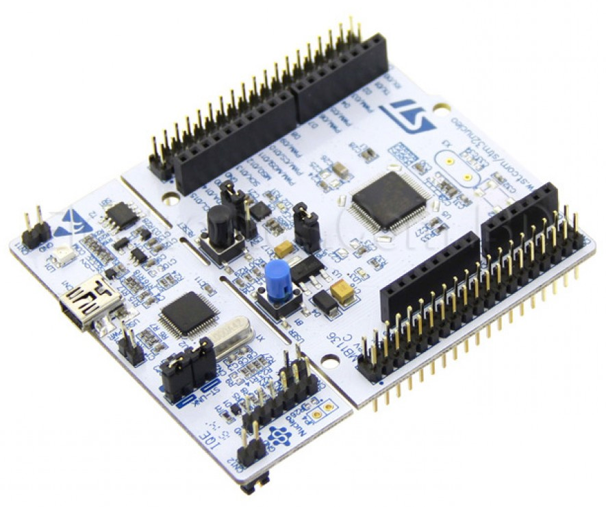
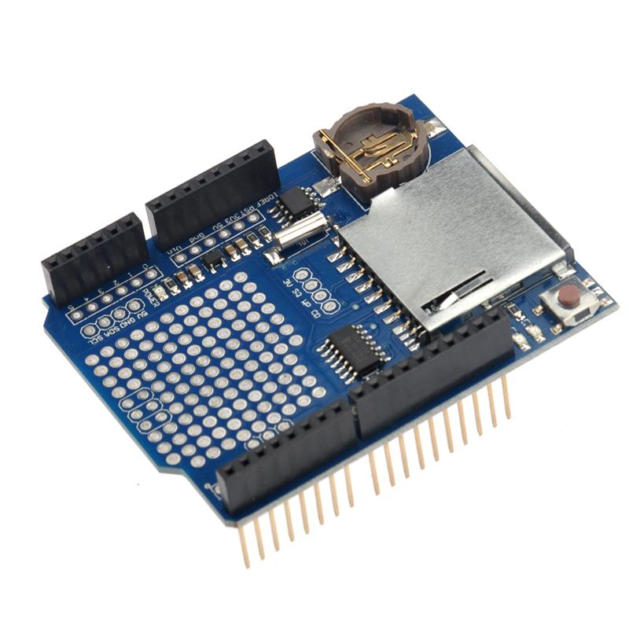

# NUCLEO-F401RE and Data Logger Shield (SD-Card + RTC) #

ToDo: So'n disclaimer, empfehle trotzdem alle schritte und fehler/pitfalls nachzumachen .. man lernt viel dabei und findet vielleicht besser
seine optimale arbeitsumgebung,
meine sicht der dinge, ich erhebe keinen anspruch auf vollständigkeit 

|                     NUCLEO-F401RE                          |                      Data Logger Shield                 |
| ---------------------------------------------------------- | ------------------------------------------------------- |
|                          |                               |
| https://www.st.com/en/evaluation-tools/nucleo-f401re.html  | https://learn.adafruit.com/adafruit-data-logger-shield  |

## Overview: ## 

|           Projects                 |          Folder           |
| ---------------------------------- | ------------------------- |
| Makefile based libopencm3-template | Software/Try01            |
| CMake based libopencm3-template    | Software/Try02CMake       | 
| STM32CubeMX HAL                    | Software/Try02Hal         | 
| mbed os                            | Software/>TODO<           | 
| Makefile based mbed os             | Software/>TODO<           | 
| PlatformIO with mbed               | Software/Try03PlatformIO  | 

## Makefile based libopencm3-template ##
**Software/Try01**

via github libopencm3/libopencm3-template at https://github.com/libopencm3/libopencm3-template.git
> Simple empty template to base your poject on
> 
> Easy "clone and go" repository for a libopencm3 based project. 

### Prerequisites ###
toolchain, make, msys, openocd

### Build ###

    make V=1 -C my-project
    make V=1 -C my-project hex
    make V=1 -C my-project srec

* Upload to Flash 
        make V=1 -C my-project flash
    OpenOCD is required.

* Serial Monitor
    
    The python module **pyserial** is required. You can install it with `python -m pip install pyserial`.
        make monitor
    upload to flash before starting the monitor: 
        make fmonitor
    
* Program listing
        make V=1 -C my-project list

* Cleanup
        make V=1 -C my-project clean

## CMake based libopencm3-template ##
**Software/Try02CMake**

## STM32CubeMX HAL ##
**Software/Try02Hal**

## mbed os ##
**Software/>TODO<**
-> E:\Projects\Elektronik\ARM\mbed\tmp\test01\Readme.md

## Makefile based mbed os ##
**Software/>TODO<**
-> E:\Projects\Elektronik\ARM\mbed\tmp\test01\Readme.md

## PlatformIO with mbed ##
**Software/Try03PlatformIO**

--------------------------------------------------------------------------------------------------------------------------------------------

# Analysis #
Table: Usability, Code Size, Binary Size, Learning Curve, Time to Market/Release, etc.

## PlatformIO ##
Annoyances:
* PlatformIO **with** Mbed Framework: You find good examples, but it is very time consuming that mbed v5 examples and v2 
  are not easy distinguishable and if you are on the wrong path you loose time. For example, you can choose v2 libraries, when
  dealing with the v5 framework. No warning, no hint.
* PlatformIO **and** Mbed Framework: This can differ in the configuration approach. Not all mbed_app.json specific settings seems to be 
  implemented well or clean. Some settings are not intuitive, for instance choosing Mbed OS is done via platformio.ini, while other related 
  switches refer to the json file. Some is implemented, some is documented and it is not always clear what refers to a specific version.
  But who knows... 
* Dependency management is fragile. See the [bugs](https://github.com/platformio/platformio-core/issues?utf8=%E2%9C%93&q=is%3Aissue+depend+) and [quirks](https://github.com/platformio/platform-ststm32/issues?utf8=%E2%9C%93&q=is%3Aissue+depend+).  
* Build Times: mbed project, full library took +450 seconds. Recompile, the only main.obj took 55 seconds, while a raw gcc compile of these steps
  would take 13 seconds. That ranges from annoying to useless, especially for small projects and home users.
* Documentation is a mess. You will find something! And on the interweb always the wrong stuff for an older version or an example that worked 
  for the creator, but not for you. 
  The next steps are familiar: Go shopping with the error messages on google and eventually fix it. If you *facepalm* you possibly 
  hit the wrong person.

## libopencm3 ##
* Functions are not well documented in the header files. This prevents modern IDE's from showing inline documentation.   

## Conclusion ##
If you want a first touch with MCU's then xxx is a vielversprechend ...
But if you want to master the device ... geht nichts dran vorbei sein datenblätter zu kennen, usw. etc.

--------------------------------------------------------------------------------------------------------------------------------------------

# Notes #
Various hints, information, notes and other points that came up during R&D.

* Display size of the segments in hexadecimal sysv-style
        cd E:\Projects\Elektronik\ARM\STM32F401\SD_RTC-Shield\Software\Try01
        arm-none-eabi-size my-project\awesomesauce.elf -Ax
    
        The options are:
        -A|-B|-G  --format={sysv|berkeley|gnu}  Select output style (default is berkeley)
        -o|-d|-x  --radix={8|10|16}         Display numbers in octal, decimal or hex
        -t        --totals                  Display the total sizes (Berkeley only)
                --common                  Display total size for *COM* syms
                --target=<bfdname>        Set the binary file format
                @<file>                   Read options from <file>
        -h        --help                    Display this information
        -v        --version                 Display the program's version

* Com-Port shennanigans via https://superuser.com/questions/835848/how-to-view-serial-com-ports-but-not-through-device-manager
        wmic path CIM_LogicalDevice where "Description like 'STMicroelectronics STLink Virtual COM Port%'" get /value > port.txt
        wmic path Win32_SerialPort > serial.txt
    
        python -c "import serial.tools.list_ports as ls;print list(ls.comports())"
        "C:\Python\Python37\python" -m serial.tools.miniterm --raw --eol CRLF --encoding ascii COM17 115200
            exit: CTRL+] => CTRL++, right beneath ü on german keyboard
    
        chgport
    Connect to serial via screen: 
        Use pyserial
        picocom

## ToDo ##

    -X-X-X-X- Di, 17 Dez 2019 23:11:08 -----------------------------------------------------------
    Verbesserungen von 
    	C:\D\ldc2shell64-arm.bat
    	C:\D\ldc2vars64.bat
    in
    	E:\Projects\Elektronik\ARM\STM32F401\SD_RTC-Shield\Software\start-clion-arm-none-eabi.bat
    	E:\Projects\Elektronik\ARM\STM32F401\SD_RTC-Shield\Software\shell-arm-none-eabi.bat
    einbauen	
    
    also am besten eine shell-arm-none-eabi-config.bat bauen
    -----------------------------------------------------------------------------------------------

## Files ##

### Doku ###
    E:\Projects\Elektronik\ARM\doc\Media\Nucleo\NUCLEO-F401RE

## Links ##

* Serial Port
    - Usage of the ST Link v2.1 virtual serial port for debugging/messaging: https://www.carminenoviello.com/2015/03/02/how-to-use-stm32-nucleo-serial-port/.
    - An Nucleo-F411RE example: https://github.com/libopencm3/libopencm3-examples/tree/master/examples/stm32/f4/nucleo-f411re/usart

* bluepill sd card usb reader

    https://www.google.de/search?sxsrf=ACYBGNTLJj9mWIX3zwWYcXrK_Iy6NIsnlg%3A1575778123510&source=hp&ei=S3fsXdS7HILDwAKx4YeICA&q=bluepill+sd+card+usb+reader&oq=bluepill+sd+card+usb+reader&gs_l=psy-ab.3...1060.8708..9252...1.0..0.131.2218.24j3......0....1..gws-wiz.......35i39j0j0i67j0i10j0i13j0i22i30j0i8i13i30j0i22i10i30j33i160.wuLUOMVQBsU&ved=0ahUKEwiUja36lqXmAhWCIVAKHbHwAYEQ4dUDCAc&uact=5
    https://github.com/Ralim/STM32F1-USB-SD
    https://github.com/Ralim/STM32F1-USB-SD/blob/master/Code/workspace/OLEDGPS/src/main.cpp
    https://forum.arduino.cc/index.php?topic=637442.0
    https://www.instructables.com/id/DIY-Temperature-Logger-With-STM32F103-MicroSD-Card/
    https://os.mbed.com/users/hudakz/code/STM32F103C8T6_Hello/
    https://www.google.de/search?sxsrf=ACYBGNRLh9afLBWAJp9rLJTIwHq_Oa9rWg%3A1575778469432&ei=pXjsXbuAGoK-kwW3xrioBg&q=stm32+sd+card+usb&oq=stm32+sd+card+usb&gs_l=psy-ab.3..0j0i8i30l3j0i8i7i30j0i333l2.8183.9071..9848...0.2..0.84.396.5......0....1..gws-wiz.......0i71j0i7i30.6XnNZCYybb4&ved=0ahUKEwj75qifmKXmAhUC36QKHTcjDmUQ4dUDCAo&uact=5
    https://community.st.com/s/question/0D50X00009XkXEP/using-fatfs-to-access-sd-card-and-usb-mass-storage-device
    https://community.st.com/s/question/0D50X00009XkYbySAF/can-you-access-a-sd-card-through-usb-msc-and-fatfs-at-the-same-time
    http://innomatic.blogspot.com/2018/09/stm32-usb-msc-device.html
    http://innomatic.blogspot.com/2018/11/stm32-usb-msd-with-sd-card.html
    https://github.com/innomatica/sdcard
    https://www.eevblog.com/forum/microcontrollers/stm32-access-sd-card-through-usb/
    http://www.chibios.com/forum/viewtopic.php?t=5061
    https://community.st.com/s/question/0D50X00009XkY0mSAF/sd-card-fatfs-and-usb-mass-storage-device
    https://www.google.de/search?sxsrf=ACYBGNS3dE28RMoPFfMZdTUqBCRapDuycw%3A1575778480120&ei=sHjsXYH3Bo2dkgXqrIuwBw&q=libopencm3+sd+card+usb&oq=libopencm3+sd+card+usb&gs_l=psy-ab.3...3702.3702..4561...0.2..0.105.105.0j1......0....2j1..gws-wiz.......0i71.up9CxEieyZk&ved=0ahUKEwiBj7WkmKXmAhWNjqQKHWrWAnYQ4dUDCAo&uact=5
    https://jiggerjuice.info/electronics/projects/arm/chanfat-stm32f103-port.html
    https://gitter.im/libopencm3/discuss/archives/2016/09/04
    https://git.drak.xyz/flabbergast/opencm3-ex/src/commit/ef9fd2db6a21d4f1ae8ad4e156e27370e8926ce1/usb_dfu/usbdfu.c
    https://www.google.de/search?sxsrf=ACYBGNSf5c1QQxkRuiYz7DNxpGXhT9fUsg%3A1575779744939&ei=oH3sXb_8OI_zkwWStZvYDw&q=blue+pill+usb+mass+storage&oq=bluepill+usb+mass+s&gs_l=psy-ab.3.0.0i22i30.15622.16322..17444...0.3..0.150.577.5j1......0....1..gws-wiz.......0i71j35i39j0i22i10i30.GUeOXK7Ow4g
    https://satoshinm.github.io/blog/171227_stm32hid_pill_duck_scriptable_usb_hid_device_using_an_stm32_blue_pill_from_mouse_jigglers_to_rubber_duckies.html
    https://www.reddit.com/r/AskElectronics/comments/alte2p/can_i_use_usb_flash_drive_for_data_storage_for/
    https://www.google.de/search?sxsrf=ACYBGNT1olsARpF1Rd2g5tbPOJWsNrERcg%3A1575779822528&source=hp&ei=7n3sXZTLHJGHwPAPnaqV-A0&q=libopencm3+usb+storage+device&oq=libopencm3+usb+storage+device&gs_l=psy-ab.3..33i160.976.9787..9915...1.0..0.109.2615.29j3......0....1..gws-wiz.......35i39j0j0i67j0i22i30j0i20i263j33i21.J3uwXdMRqmI&ved=0ahUKEwiU-r-knaXmAhWRAxAIHR1VBd8Q4dUDCAc&uact=5
    https://github.com/libopencm3/libopencm3-examples/tree/master/examples/stm32/f1
    https://github.com/libopencm3/libopencm3-examples
    https://github.com/texane/stlink
    https://github.com/libopencm3/libopencm3-template
    https://github.com/libopencm3/libopencm3-examples/tree/master/examples/stm32/f4/stm32f4-discovery/usb_msc
    https://github.com/libopencm3/libopencm3-examples/blob/master/examples/stm32/f4/stm32f4-discovery/usb_msc/msc.c
    https://github.com/libopencm3/libopencm3-examples/blob/master/examples/stm32/f4/stm32f4-discovery/usb_msc/ramdisk.c
    