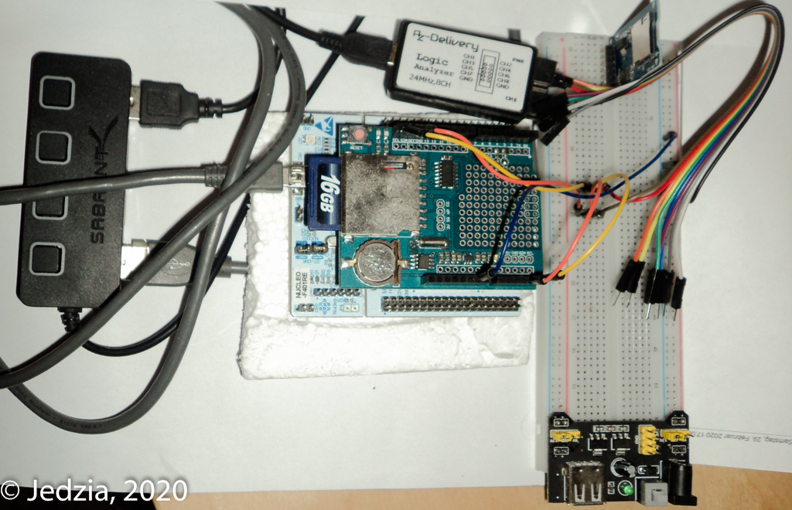

# RTC-Shield test setup with NUCLEO STM32F401RET6. #

|                     NUCLEO-F401RE                          |                      Data Logger Shield                 |
| ---------------------------------------------------------- | ------------------------------------------------------- |
|                          |                   |
| https://www.st.com/en/evaluation-tools/nucleo-f401re.html  | https://learn.adafruit.com/adafruit-data-logger-shield  |

|                                   Development Setup                                   |
| ------------------------------------------------------------------------------------- |
|          |
| [blinky](blinky/README.md)                                                            |

Go to [blinky](blinky/README.md) for a simple I2C example based on CMake and the GNU-ARM-GCC toolchain.
